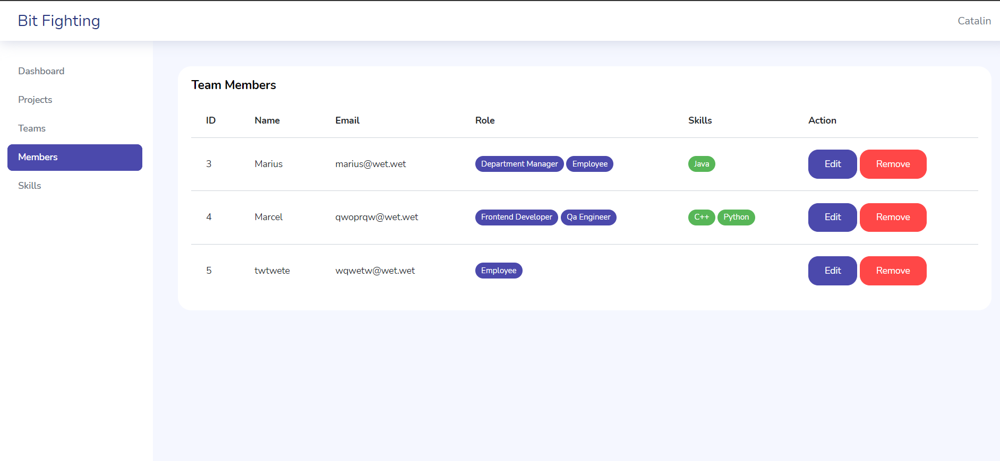

# Bit Fighting

Revolutionizing Team Assembly in Enterprises a cutting-edge solution designed to streamline the process of assembling project teams in medium to large enterprises.




## Prerequisites

Before proceeding with the installation, make sure you have the following prerequisites installed on your machine:

1. PHP: PHP (>= 7.3.0) is required to run Laravel. [ You can download and install PHP from the official PHP website](https://www.php.net/).

- Run the installer and follow the installation wizard.
- During the installation process, make sure to select the option to add PHP to the system PATH.

Setting Environment Variables:
- Right-click on "This PC" or "My Computer" and select "Properties."
- Click on "Advanced system settings" on the left panel.
- In the System Properties window, click on the "Environment Variables..." button.
- In the "System variables" section, find the "Path" variable and select it, then click "Edit..."
- Click "New" and add the path to your PHP installation directory (e.g., C:\php) to the list of paths.
Click "OK" to save the changes.

2. Composer: Composer is a dependency manager for PHP. [You can download and install Composer from the official Composer website](https://getcomposer.org/).
- Run the installer and follow the installation wizard.
- During the installation process, make sure to select the option to add Composer to the system PATH.

**When installing Composer, PHP must be already installed on your system. Composer itself is a PHP application, and it requires PHP to function. However, when installing Composer, you don't explicitly install PHP; rather, you ensure that PHP is already installed and properly configured on your system.**

**So, in the Composer installation instructions, it's implicitly assumed that PHP is already installed.**

3. XAMPP. [Download XAMPP from the official website](https://www.apachefriends.org/).
- Run the installer and follow the installation wizard.
- During the installation process, choose the components you want to install. Ensure that Apache and MySQL are selected.
- Choose the installation directory and complete the installation process.
- Once installed, open the XAMPP Control Panel. You can usually find it in the installation directory (C:\xampp by default).
- Start Apache and MySQL by clicking the "Start" button next to their respective names in the control panel.
- Once Apache and MySQL are running, you can access your local server by opening a web browser and navigating to http://localhost.

4. Git. [Download the Git installer from the official website](https://git-scm.com/).
- Run the installer and follow the installation wizard.
- During the installation process, you can choose the default options or customize the installation settings according to your preferences.
## Installation

1. Cloning the Repository:
- Open a terminal or command prompt.
- Navigate to the directory where you want to store the project.
- Run the following command to clone the repository:
```bash
git clone https://github.com/catalingrigoriev285/bit_fighting.git
```
2. Installing Dependencies:
- Navigate into the project directory.
- Run the following command to install PHP dependencies using Composer:
```bash
composer install
```
3. Environment Configuration:
- Copy the `.env.example` file and rename it to `.env`:
- Open the `.env` file and configure database connection settings, including database name, username, password, and other relevant settings.

```bash
DB_CONNECTION=mysql
DB_HOST=127.0.0.1
DB_PORT=3306
DB_DATABASE=bit_fighting
DB_USERNAME=root
DB_PASSWORD=
```

4. Generating Application Key:
- Run the following command to generate a unique application key:
```bash
php artisan key:generate
```

5. Database Setup:
- Run the following command to run all pending migrations and seed the database (if necessary):
```bash
php artisan migrate
```

if you want to reset it:
```bash
php artisan migrate:fresh
```

next you should to seed default app roles:
```bash
php artisan db:seed RoleSeeder --class
```
## Deployment

You can use Laravel's built-in development server to serve the application. Run the following command:

```bash
php artisan serve
```

Open your web browser and navigate to http://localhost:8000 to view our project.
